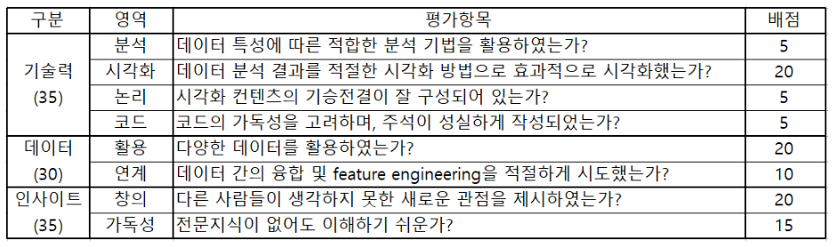

# 탄소중립을 위한 기후기술 정보 시각화 경진대회

- 목적: Dacon에서 진행되는 대회인 탄소중립을 위한 기후기술 정보 시각화 경진대회에 참여해 보고 시각화 기술을 익힌다.

- 대회 주소: https://dacon.io/competitions/official/235911/overview/description

- 기후기술 분류체계: https://www.ctis.re.kr/ko/techClass/classification.do?key=1141

- 참고
  - 기후기술 국가연구개발사업 조사분석 보고서: https://gtck.re.kr/gtck/gtcPublication.do?mode=view&articleNo=2622
  - 기후기술 산업통계 및 보고서: https://bit.ly/3yAiC1z, https://bit.ly/3yAiC1z

- 평가
  - 1차 평가: 리더보드 유저평가 투표결과 상위 10개 팀
  - 2차 평가: DACON 및 녹색기술센터 심사위원단 정성 평가(5개 팀 수상)

- 1차 평가
  - 투표기간(2022년 6월 27일 ~ 2022년 6월 30일)에 이루어진 투표점수만 집계

- 2차 평가
  - 심사기준
    

- 외부 데이터
  - 법적 제약이 없는 모든 기후기술 관련 정보
  

- 개인 또는 팀 참여 규칙
  - 개인 또는 팀을 이루어 참여 가능

- 제출 방법
  - 대회의 코드 공유 페이지에 시각화 자료 게시
  - 사용 가능 툴: Python, R, Tableau
  - 게시물 형식: .ipynb(20MB를 초과할 수 없음)

- 일정
  - 대회 기간: 2022.05.23.~ 2022.06.26.
  - 1차평가(투표) 기간: 2022.06.27.~2022.06.30.
  - 2차평가 기간: 2022.07.01.~2022.07.06.
  - 수상자 발표: 2022.07.07.